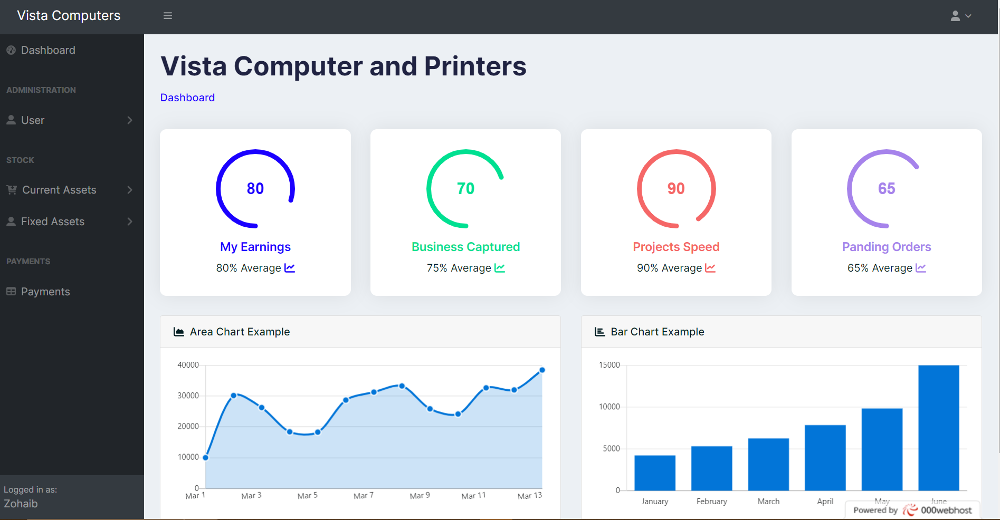

<h1 align='center'>stock-management-system</h1>

<h2>About the project</h2>

  
This is a <strong>Stock Management System</strong> was origanlly developed for jus the learning purposes
    Started the project for learning and getting more experience about Core PHP.
    Used starBootstrap and dev-dashboard to design the frontend. 
    Merged the both dashboards to give a unique look to the frontend.
    This is the first project with Ajax.
    This is also my first project where i used JQUERY.
    The system is secure you have to login into the system with your correct credentials, no one of the users can't update or delete any sort of data with out getting caught by the system.
    Different roles are there for admin and user.
    Only Admins are allowed to add, update, and delete staff.

👉 Live Demo: <a href='https://egoistic-aircraft.000webhostapp.com/'>Live Demo</a>

<h4>Username: Zohaib </h4>
<h4>Password: 12345678</h4>

<h3>Build with:</h3>

» Html  
» Css  
» JS  
» Jqurey  
» Ajax  
» PHP  
» MySQL

<h2>Screenshots of the Project 📸</h2>
 
<h3 align='center'> Dashboard 🏡</h3>

